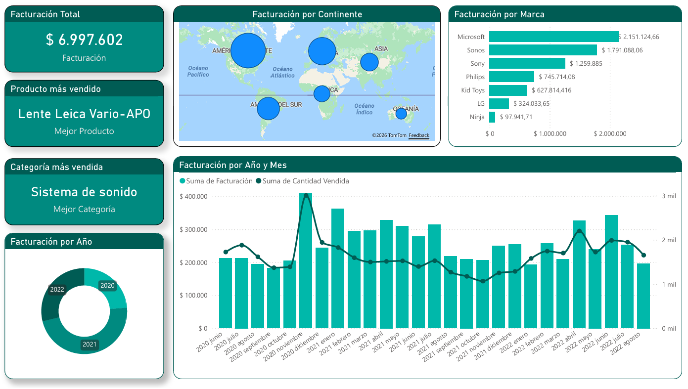
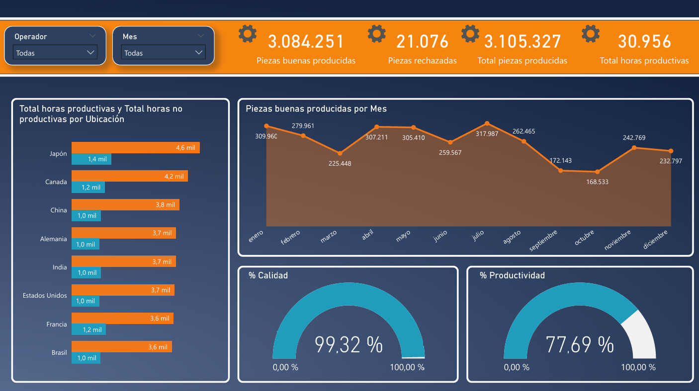
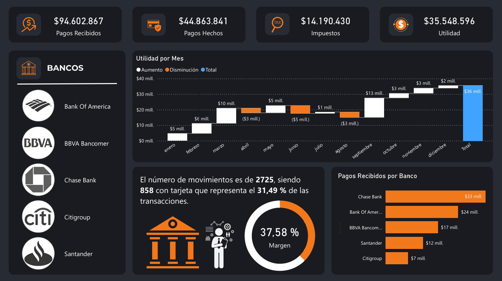

# Portfolio de Análisis de Datos e Inteligencia de Negocio
Te doy la bienvenida a mi portfolio de datos. Este espacio documenta mi capacidad para transformar información cruda en visualizaciones interactivas que facilitan la toma de decisiones estratégicas.

🛠️ **Herramientas y Tecnologías Utilizadas**:
Para el desarrollo de los tableros presentados en este repositorio, he implementado un flujo de trabajo (Pipeline) estandarizado utilizando el siguiente stack tecnológico:

*   **Procesamiento y ETL:** **Power Query** (Extracción, limpieza, normalización y transformación de datasets crudos).
*   **Modelado y Cálculos:** **DAX** (Desarrollo de medidas, columnas calculadas e inteligencia de tiempo) y modelado relacional de datos.
*   **Visualización de Datos:** **Power BI** (Diseño de interactividad, marcadores, tooltips y aplicación de principios de UX/UI para facilitar la lectura gerencial).
*   **Fuentes de Datos:** Archivos estructurados en **Microsoft Excel** / CSV.

📁 **Organización del Repositorio**:
Para garantizar la trazabilidad de los datos y facilitar la revisión técnica, este repositorio está estructurado bajo las siguientes carpetas:

*   📂 **`/datasets`**: Bases de datos originales (materia prima) que evidencian el estado de la información antes del proceso de limpieza.
*   📂 **`/dashboards_pbix`**: Archivos editables de Power BI, disponibles para auditar el modelado relacional y la sintaxis de las fórmulas DAX.
*   📂 **`/exports_pdf`**: Exportaciones estáticas para una lectura rápida del diseño final sin necesidad de abrir el motor gráfico.
*   📄 **`README.md`**: El documento actual, que detalla el contexto de negocio, los objetivos y las conclusiones clave (*insights*) de cada caso de estudio.

## 📊 **Proyecto 1: Análisis de Ventas e Inteligencia de Negocio (Ventas Tech)**
*Contexto y Objetivo:*
Desarrollo de un dashboard interactivo para una tienda global de electrónica, diseñado para transformar registros transaccionales crudos en inteligencia de negocio. El objetivo principal es monitorear la facturación histórica, identificar los principales drivers de ingresos (marcas y productos estrella), analizar la distribución geográfica del mercado y detectar patrones de estacionalidad para la toma de decisiones estratégicas.

*Vista del Dashboard:*

**📈 Insights de Negocio y Conclusiones Clave:**

*Concentración de Ingresos por Marca (Ley de Pareto):* De la facturación total histórica de $6.997.602, el mercado está fuertemente dominado por el top 3 de marcas: Microsoft (+$2.1M), Sonos y Sony. Estas tres marcas representan la mayor cuota de mercado, indicando una clara dependencia estratégica sobre este segmento de proveedores.

*Rendimiento de Categoría vs. Producto:* Aunque la categoría con mayor volumen de facturación es "Sistema de sonido" (impulsada por marcas como Sonos y Sony), el producto individual más vendido pertenece al rubro de fotografía ("Lente Leica Vario-APO"). Esto sugiere que la empresa maneja categorías de alto volumen de ventas constantes (audio) junto con productos individuales de ticket muy alto (fotografía premium).

*Patrones de Estacionalidad:* El análisis temporal de Facturación vs. Cantidad Vendida revela picos drásticos de rendimiento en los últimos meses del año (noviembre/diciembre de 2020), lo cual se alinea con eventos de alto consumo como Black Friday y la temporada de fiestas.

*Foco Geográfico:* La distribución geoespacial indica que América del Norte y Europa son los mercados más consolidados y de mayor tamaño (representados por la magnitud de las burbujas). Sin embargo, existe una presencia operativa en América del Sur que podría representar una oportunidad de expansión o requerir una estrategia de penetración diferente.

## ⚙️ Proyecto 2: Inteligencia Operativa y Eficiencia de Manufactura (Producción Global) ##
*Contexto y Objetivo:*
Desarrollo de una herramienta de control y seguimiento para una operación de manufactura con plantas distribuidas a nivel global. El objetivo de este modelo es monitorear los indicadores clave de rendimiento (KPIs) de la cadena de producción, evaluando el balance entre la calidad del producto terminado y la eficiencia del tiempo operativo (horas productivas vs. horas muertas) a través de distintas ubicaciones y meses.

*Vista del Dashboard:*

**📈 Insights de Negocio y Conclusiones Clave:**

*Alta Calidad vs. Oportunidad en Productividad:* La operación global mantiene un estándar de calidad de excelencia (99.32%), con una tasa de rechazo sumamente baja (apenas 21k piezas sobre un volumen total de 3.1M). Sin embargo, el índice de Productividad general se sitúa en un 77.69%. Esto indica que el proceso es efectivo (lo que se produce, se hace bien), pero no completamente eficiente, señalando una clara oportunidad de negocio para reducir tiempos muertos e incrementar la utilización de la capacidad instalada.

*Desempeño y Capacidad por Ubicación:* Japón lidera significativamente la operación con el mayor volumen de horas productivas (4.6 mil), seguido por Canadá (4.2 mil). No obstante, es crítico observar la proporción de horas no productivas; plantas como Canadá y Francia registran 1.2 mil horas inactivas, lo que sugiere la necesidad de auditar los esquemas de mantenimiento o los cuellos de botella logísticos en esas ubicaciones.

*Caída Operativa en Q3/Q4:* El análisis temporal de piezas buenas producidas muestra fluctuaciones constantes, pero revela una caída crítica hacia los meses de septiembre y octubre, tocando un piso de 168.533 piezas. Este patrón demanda una investigación de las causas raíz: podría estar asociado a paradas de planta programadas, desabastecimiento en la cadena de suministro de materias primas o falta de personal.

*Gestión por Operador:* La disponibilidad de filtros interactivos permite a los líderes operativos aislar el rendimiento. Cruzar los datos de los operadores con mayor porcentaje de productividad y menor tasa de rechazo permitiría identificar y estandarizar las "mejores prácticas" para replicarlas en ubicaciones con métricas por debajo del promedio.

## 💰 Proyecto 3: Control Financiero y Flujo de Caja (B2B Comercial) ##
*Contexto y Objetivo:*
Desarrollo de un dashboard ejecutivo para la dirección financiera de una empresa comercial B2B con operaciones multi-ciudad. El objetivo es consolidar y analizar más de 2,700 movimientos bancarios para diagnosticar la salud financiera del negocio. La herramienta permite monitorear la utilidad neta mensual, evaluar los márgenes operativos, identificar la concentración de riesgo por entidad bancaria y analizar la estructura de los métodos de pago.

*Vista del Dashboard:*

**📈 Insights de Negocio y Conclusiones Clave:**

*Salud Financiera y Carga Impositiva:* El negocio presenta una estructura sana con un margen operativo del 37.58% y una utilidad neta consolidada de $35.5M frente a ingresos por $94.6M. Resulta vital destacar que la carga tributaria ($14.1M) representa un peso significativo sobre los pagos realizados ($44.8M), lo que subraya la importancia de una correcta planificación fiscal y previsión de liquidez para el cumplimiento de obligaciones.

*Volatilidad del Flujo de Caja (Análisis de Cascada):* El análisis de la utilidad mensual revela una marcada estacionalidad. Se observa un fuerte crecimiento sostenido en el primer trimestre (enero-marzo), seguido por una volatilidad con contracciones operativas en abril, junio y agosto. Sin embargo, septiembre compensa drásticamente estas caídas con un ingreso extraordinario de $13M. Esta irregularidad exige políticas de capital de trabajo estrictas para cubrir los meses de flujo negativo.

*Concentración de Liquidez (Riesgo Bancario):* Existe una clara concentración de los ingresos. De los $94.6M totales, Chase Bank ($33M) y Bank of America ($24M) capturan más del 60% de los flujos de entrada. Si bien son entidades de primera línea, desde una perspectiva de evaluación de riesgos, diversificar la cobranza hacia bancos con menor volumen (como Citigroup o Santander) podría mitigar riesgos operativos ante contingencias sistémicas.

*Composición Transaccional:* El 31.49% del volumen de movimientos (858 de 2725) se realiza mediante tarjeta. En un entorno B2B, este es un porcentaje considerable que impacta directamente en el costo de adquisición (por comisiones de pasarelas de pago y adquirentes). Monitorear esta métrica es clave para evaluar si es conveniente incentivar las transferencias bancarias directas para proteger aún más el margen neto del 37.58%.
